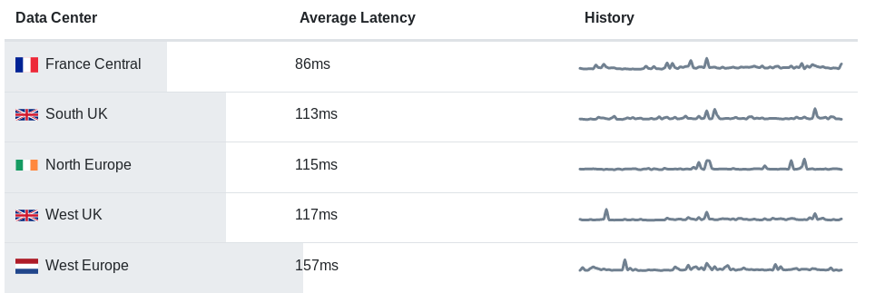
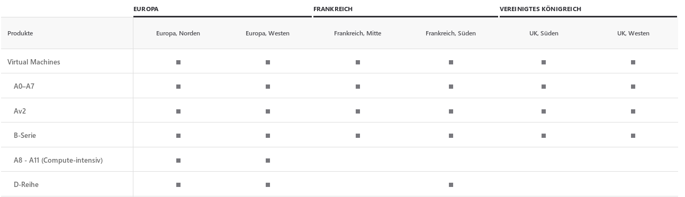

# Creating VMs automatically via CLI

At first we used the browser's GUI to create a virtual machine in the cloud, for example at Azure or Google Cloud. 
In the next step we want to make it an automatic, repeatable task by using the CLI from the respective cloud provider.

At first I run everything on the Azure Cloud, later we might provision Google Cloud Platform as well.

## Server location & Operating System

When creating and running a web server, the very first questions are:
 1. Location of the server (latency/data laws)
 2. Resources which will be accessible 
 3. OS to run

### Location
Let's start with the location of the server. I found [this](https://www.petri.com/tips-choosing-microsoft-azure-region) website which offers 
some insights on what to think about when choosing a location for Azure. They provide a link to a nice [tool](http://azurespeedtest.azurewebsites.net/) 
which measures the latency to all available server locations from Azure cloud from the calling browser location (here Granada, Spain).

For Granada the (currently) best locations are :

Obviously France Central is the winner here. Next, I checked if the service of VMs is available there at [this](https://azure.microsoft.com/de-de/global-infrastructure/services/?products=virtual-machines&regions=us-east,us-east-2,us-central,us-north-central,us-south-central,us-west-central,us-west,us-west-2,europe-north,europe-west,united-kingdom-south,united-kingdom-west,france-central,france-south) page: 

This matrix shows the availability of azure-vm-plans by selected regions. This will be important for the next step, chosing resources for the VM. 

There might be more complex scenarios to consider, like specific central ISP points' failure of server, but for this project this will be out of range.

### Resources
To select the correct resources for your VM you have to think about your webservice's functions. 
- How much data will be stored? (-> Storage size) 
- How intensive are the computations? (-> CPU/RAM)
- Is there high traffic expected, which needs high parallelism? (-> CPU)
- How important are Read/Write speeds for a good UX? (-> Storage kind (hdd/ssd/ssd premium))

The project which I develop here only needs the minimum of all these choices as it is an API which will mainly respond to Android-API calls the first time the app is opened or after the content on the server is updated.
Of course, with some more resources we might get some extra speed on responses (probably barely notable) but I want to keep the price for the VM as small as possible.

In this case Azure B1s with _(1GB RAM/ 1 vCPU)_ and _20GB of SSD Standard_ storage is sufficient and cheap.

### Operating systems
In the last milestone I already stated a few reasons for choosing the right OS for the application. 
After eliminating systems you can not use (software restrictions) or are overly complicated, you just have to choose one and see how your service works.

