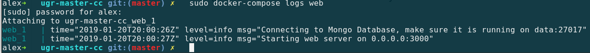
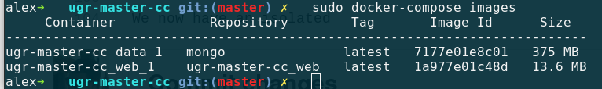
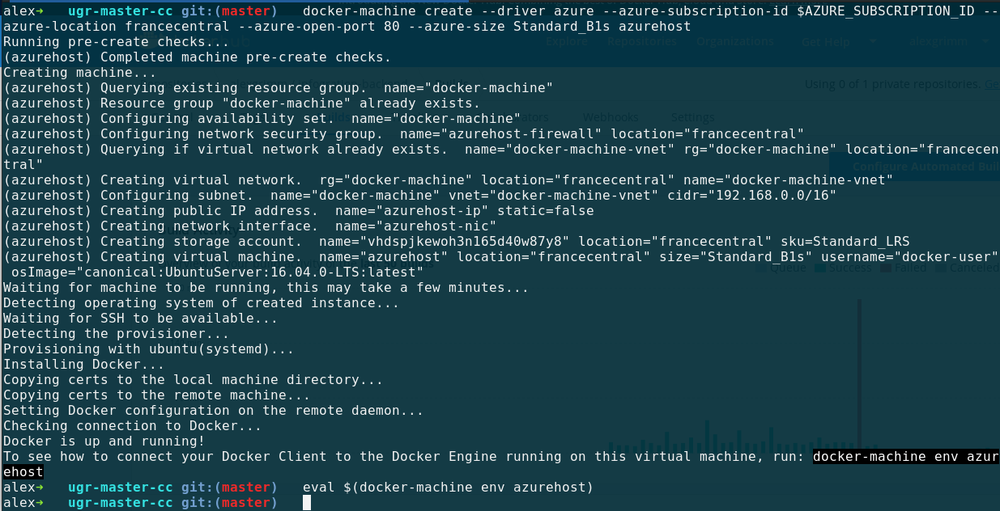
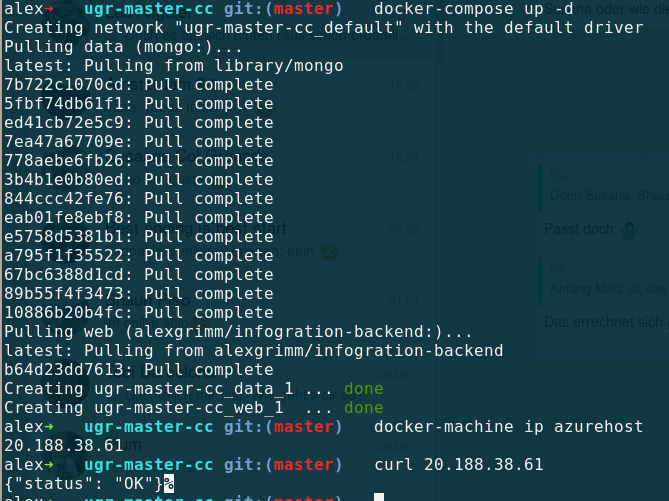
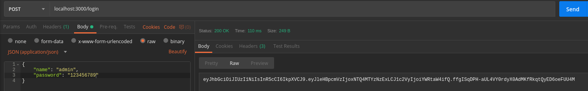
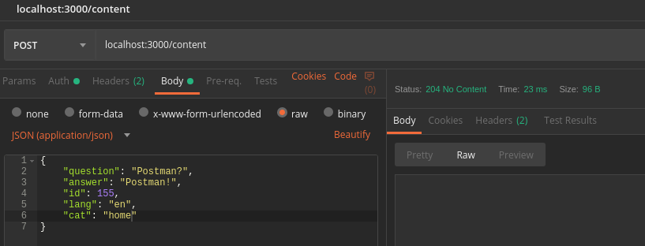
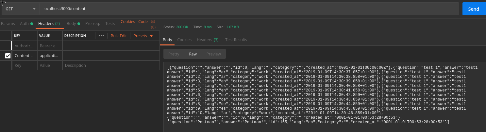

# Installation of docker & docker-compose

As I am working on a fedora machine, I am using [this](https://docs.docker.com/install/linux/docker-ce/fedora/#install-using-the-repository) guide of installing docker via repository.

Next I am starting the docker daemon via `$ sudo systemctl start docker` and I verfy that everything is running with

`$ sudo docker run hello-world`

After this returns correctly, we are ready to use it.

To use docker-compose on the local machine, we have to install that extra. I chose the global installation for Linux, but it is also available via [pip or Docker itself](https://docs.docker.com/compose/install/).

To installi it on linux we do
```bash
sudo curl -L "https://github.com/docker/compose/releases/download/1.23.2/docker-compose-$(uname -s)-$(uname -m)" -o /usr/local/bin/docker-compose
sudo chmod +x /usr/local/bin/docker-compose
```
Which installs docker-compose 1.23.2 on the machine, which is a fairly late version. One only needs to change the version number for other versions.

Running `$ sudo docker-compose --version` indicates a successful installation. 

# Running in Docker environment

I will create 2 containers, one for the REST-API and the second one for MongoDB service. To be able to start different containers and let them communicate among them we will use **docker-compose**. 

## API-Dockerfile

The [Dockerfile](https://github.com/alex1ai/ugr-master-cc/Dockerfile) of the REST-API looks like this:

```Dockerfile
# Use latest stable golang base container, alpine version because it is much smaller than the normal one
FROM golang:1.11-alpine AS build

# Install tools required for project
RUN apk update
RUN apk add --no-cache git

# Get project from github master
RUN go get github.com/alex1ai/ugr-master-cc

# Switch to project dir and download dependencies
WORKDIR /go/src/github.com/alex1ai/ugr-master-cc
RUN go get -d

# Set environment variables to compile go application to use in scratch below (more below)
ENV CGO_ENABLED=0 GOOS=linux GOARCH=amd64
RUN go build -o /bin/infogration

# Get a totally empty image ("start from scratch")
FROM scratch

# Copy the compiled binary from the intermediate container above to the new scratch container
COPY --from=build /bin/infogration /infogration

# Start server
ENTRYPOINT ["/infogration"]
```

I commented (nearly) every line above with its function. As Go is a compiled language (in contrast to interpretated ones such as JS or Python), the container, in which the binary is executed later, does not have to have any other functionality. Therefore I could use [Scratch](https://docs.docker.com/samples/library/scratch/) as a base image, which is the smallest possible image (really empty). 

Yet I first ran into a few 

`web_1   | standard_init_linux.go:207: exec user process caused "no such file or directory"` 

errors when executing `$ sudo docker-compose up`. Through some online research I found [this](https://blog.codeship.com/building-minimal-docker-containers-for-go-applications/) blog and also this [docker blog](https://blog.docker.com/2016/09/docker-golang/) which handles this issue.

The problem's solution is this section: 

```Dockerfile
# Set environment variables to compile go application to use in scratch below
ENV CGO_ENABLED=0 GOOS=linux GOARCH=amd64
RUN go build -o /bin/infogration
```

As go has the ability of cross-compilation (compile binaries for another system architecture as the one the command `go build ..` is exectuted) we need to set some environment variables to make an actual executable binary for the SCRATCH image. Setting those env-variables includes some extra C libraries into the binary application which are still needed for execution, but Scratch doesn't even have those.

## Starting the Webservice via docker-compose

Only using the above Dockerfile with `$ docker run .` will crash soon, as the database is not found (because it is not started and the rest-api does not find it on the default route localhost:27017). 
I am going to use docker-compose to do handle both of those problems (start DB & tell service the adress where to look).
The docker-compose.yml file looks like this:

```yaml
version: '3'
services:
  data:
    image: mongo
    restart: always
    command: --smallfiles
  web:
    build: .
    environment:
      - MONGO_IP=data
    env_file:
      - secrets.env
    ports:
     - "80:3000"
  ```
  
We are defining two containers to be created, "data" and "web". 
  
"data" uses the official mongo image from Docker Hub. Furthermore the mongo-daemon will be restarted everytime we call `docker-compose up`. On the Docker Hub page of the mongo image I found the tip with `command: --smallfiles`. To quote the documentation :
  
 > Sets MongoDB to use a smaller default file size. The --smallfiles option reduces the initial size for data files and limits the maximum size to 512 megabytes. --smallfiles also reduces the size of each journal file from 1 gigabyte to 128 megabytes. Use --smallfiles if you have a large number of databases that each holds a small quantity of data.
 
This means mongo will block less file space, which after all might save some cents when running in a cloud environment.
 
"web" is build from Dockerfile (see above) which is in the same directory as the docker-compose.yml file. Here we also set the environment variable of the IP (or local DNS in this case) where the webservice will find the database. Using `ports: 80:3000` the container port (**Last number**) will be accessible from the host machine (first number) on the specified port 80 (where the webserver is running). In cloud environments the first number will nearly always be 80/443 for HTTP/HTTPS respectively if there is no further internal (VM) port forwarding.

The part of `env_file: ...` is explained at the bottom of this page. It will set environment variables in the container from a key/value file called _secrets.env_. 
 
Running `$ sudo docker-compose up -d` will start the webservice in the docker environment. `-d` is for detached mode, which enables us to start it and leave the shell without the command being killed. To get some logs from the running containers, one can use `$ sudo docker-compose logs` to get logs of all running containers or specify a machine, e.g. `$ sudo docker-compose logs web`. 
 

 
 To kill the docker environment, use `$ sudo docker-compose down`, again one can specify single machines by adding its name in the end.
 
 The size of the machines is:
 
 
 
 We can see that while MongoDB is HUGE, the webservice only has ~14MB in total.
 
 # Docker Hub
 
 I created an account on Docker Hub to make the webservice publicly available.
 
 Next I created a new repository following the GUI in the browser. The service can be found by the name _alexgrimm/infogration-backend_. 
 
 While I was at the creation, I also setup a Github-Hook for automatic Docker Hub building. I basically followed [this](https://docs.docker.com/docker-hub/builds/) official documentation for connecting the services. 
 
 The Docker Hub version will be updated automatically from now on at every push to master.
 
 [infogration-backend on docker hub](https://cloud.docker.com/u/alexgrimm/repository/docker/alexgrimm/infogration-backend)
 
 From now on the service can be used with its image name _alexgrimm/infogration-backend_ in any Dockerfile/docker-compose.yaml or directly on the CLI (e.g. `$sudo docker run alexgrimm/infogration-backend`). 
 
 **Warning**: Using the Dockerhub version only spins up the service and has no database connected. Yet when starting the service will look for a MongoDB service running somewhere. Therefore you need to provide a MongoDB-IP (and Port if not default) via environment variable when starting the docker hub container (add parameter -e MONGO_IP={ipaddress} to docker run).
 
# Running the Containers remotely on Azure

To deploy the webservice on Azure, I chose to use _docker-machine_ because it uses, kind of, the same CLI as Vagrant and I got to know that one it the previous milestone. I will use the dockerhub-image for the webservice because this only has to download the 6MB webservice instead of building the application itself (where downloading Go already is >100MB and only one of 10 steps in the Dockerfile).

At first I create the virtual machine:

```bash
docker-machine create --driver azure --azure-subscription-id $AZURE_SUBSCRIPTION_ID --azure-location francecentral --azure-open-port 80 --azure-size Standard_B1s azurehost
```



The optional parameters describe the VM which is created, which are the same as in all previous deployments. Ubuntu 16.04 is chosen as a default VM, and we can open port 80 directly on creation time to reach the webservice. `$ eval $(docker-machine env azurehost)` sets the azure machine as default for all upcoming commands for docker(-compose).
 
After that we can deploy the service which uses the local docker-compose.yml file. Last but not least we can get the IP of the created VM and make a request to comfirm that the service is running:



In order to save resources, I will shutdown and remove everything after the tests with `$ azure-machine rm azurehost`.

# Terminating project itself: Authorization

While I created a docker environment for this project in this milestone, I also made a huge step towards finishing this project.

I introduced authorization in order to control the usage of the webservice. Only authorized persons should be able to edit content, but everyone can retrieve content via the GET routes.

Therefore, I leveraged JWT in order to provide temporal access to all routes after login. 
A person can not register himself easily (important for my scenario) but can be added by other authorized persons. 

Example time flow for deleting something:
```
Client: POST {"name": "example", pass: "asdf"} /login
Server: DB-Lookup if user exsists and password hashes match.
  Everything fine: Send JWT to Client + Header=StatusOK
  Wrong credentials: Header=StatusForbidden or StatusBadRequest
Client: 
  JWT-Token received -> Store locally and use in further requests in header Authorization=Bearer $TOKEN
  StatusForbidden received -> Try again or let it be
  
  DELETE /content/de/1 , Header variable: Authorization=Bearer $TOKEN
Server: 
  1.  Validate JWT
  2.  If valid: execute deletion of specified content, return StatusNoContent on success
      Else: return StatusForbidden

```

The users are stored in the same MongoDB-Database as the content of the webpage. Therefore a new Collection "users" is created. Every received plaintext password (or front-end sha-hash) will be encrypted by bcrypt befored being stored in the collection.

I also created a default admin user, which is automatically created at server startup. This ensures that always someone can edit and add more content to the service. 

## Server secrets

As every server involves a few authorization and security keys I had to think about a solution how to store/retrieve them. I decided to take the solution of providing credentials via environment variables.

In my case I provide an env_file for docker-compose in the repository root folder called secrets.env and pass it to docker-compose :

```yaml
version: '3'
services:
  data:
    image: mongo
    restart: always
    command: --smallfiles
  web:
    build: .
    env_file:
      - secrets.env
    environment:
      - MONGO_IP=data
    ports:
    - "80:3000"
```

while the env_files follows the [rules from docker-compose env_files](https://docs.docker.com/compose/env-file/) (every line is a KEY=VALUE pair).

One could also pass the env variables different, for example via `docker-compose up -e KEY1=VALUE -e KEY2=VALUE`, but for multiple execution it is easier providing the file.

The server will look for the secrets:
  - ADMIN_PW
  - JWT_SECRET
  
in the environment. **If they are not set, the user will use default values for both, which are publicly available in the source code.** The server will also log warnings on startup, if those values are not customized.

## Postman Tests for authentication

We will be returned a JWT-Token when making a POST-request to /login for a registered user:



Adding this token to the head as Bearer Authorization allows us to add content via POST /content:



While we can see that the content was added via GET /content. We also send the JWT with it (too lazy to delete), but the server just ignores it in this case and shows that the content was added.



There are some more entities in there already, as I have played around with the database a little and didn't reset it. Should not be of concern for making this point of showing successful authenticated actions.


