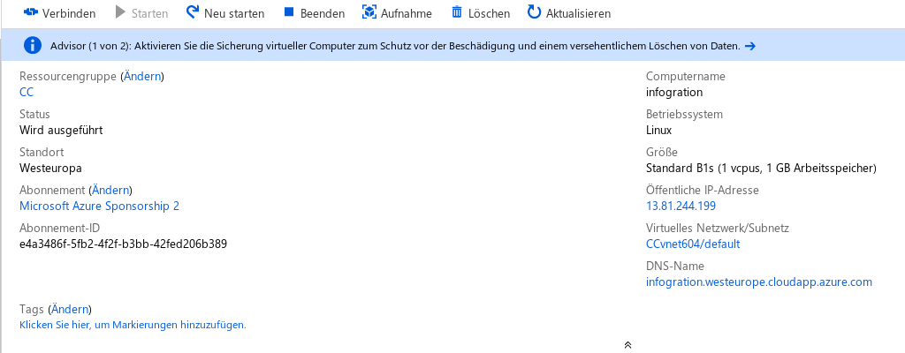
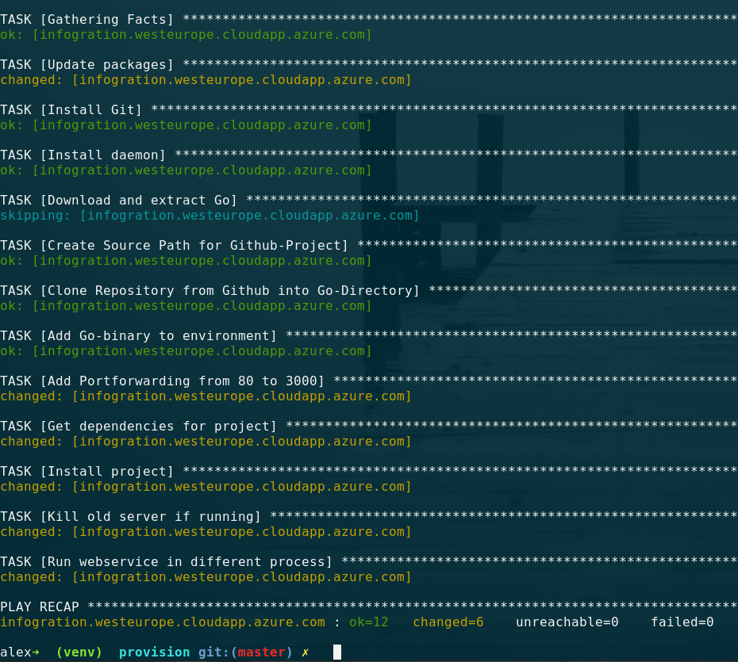
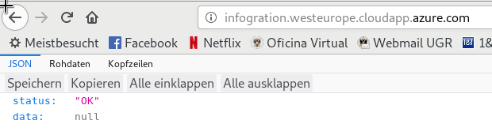
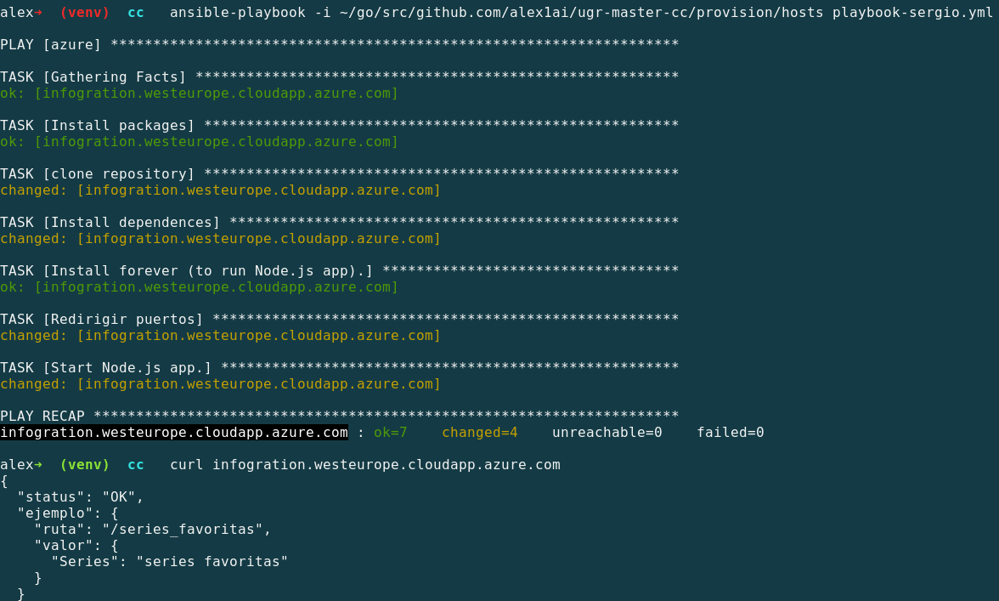

# Provision to VM

This milestone of creating a configuration management for easy provisioning to any VM will be documented in the following.

As a cloud infrastructure I chose Azure, as we have got a Sponsorship there to finish this work.

## Configuration of Virtual Machine

As this project does not make any extensive computations and only deals with text files, 
I chose one of the smalles VM configurations possible (Azure B1s):

- Name of the machine: infogration
- Region: Europe West
- Authentification: SSH
- Open Ports: HTTP, SSH
- Disk: SSD Standard (30 GiB)
- vCPUs: 1
- RAM: 1 Gb
- Operating System: Ubuntu 18.04 LTS server
- DNS name: infogration.westeurope.cloudapp.azure.com



### Why Ubuntu 18.04 LTS?

The choice of Linux, in contrast to Windows, is logical as many programming packages are not even available for Windows and we can use bash for scripting, which I know. This is also the reason why most of internet webservers use any Linux distribution.

So which Linux to chose? Debian-based (Debian/Ubuntu/..), Red Hat-based (CentOs/Fedora...) or FreeBSD? [This](https://www.makeuseof.com/tag/best-linux-server-operating-systems/) nice read introduces some differences between the distros.
Here I chose a Debian based image because, as stated in the link, Debian is known for being the most stable distribution out there. Furthermore the APT package manager is, in my subjective opinion, one of the most powerful with nearly every required package included.
So why Ubuntu and not Debian itself? Well, Debian does not have a server-only image to use directly, this means any image will ship with a GUI/window manager such as GNOME. This is unnecessary in a server-only deployment and would increase the size of the raw image. 
And, last but now least, why Version 18.04 LTS? Well, choosing a LTS version is always a smart choice if one does not want to update the OS every year. I also like to say, new is always better, which is why I chose 18.04 over previous LTS versions. Furthermore 18.04 finally uses python3 as default python, which I (and Ansible since the latest versions) prefer.

As this project is written in Go, I also need to respect its [requirements](https://golang.org/doc/install), which means kFreeBSD/Debian GNU are not supported, just as CentOS and RHEL 5.x. 
## Ansible

For configuration management of virtual machines I chose Ansible as we did have a dedicated seminar about it in class and I liked its handling a little more then, for example, chef.
I installed Ansible for Linux as it is described on the Website via pip in a virtual environment.
All files that we need for provisioning are in the subfolder provision in the master branch of this repository. 
it consists of two files:

 - hosts
 - playbook.yml
 
The _hosts_ file contains all ips (or DNS-aliases) which you want to configure, it is also possible to create certain groups:

```
[azure]
infogration.westeurope.cloudapp.azure.com
```

The _playbook.yml_ describes all tasks that should be executed, while idempotence should always be taken care of.
My Playbook for provisioning of a Go-Project looks like this:

- Update APT
- Install Git
- Install daemon (need this in the end to start service)
- Download and Extract Go 1.11.2
- Create typical Go-workspace structure
- Add symbolic link for go/bin/go to execute it via `$ go build`
- Clone github repository in workspace
- Add Port forwarding to iptables (Really important to reach the webservice)
- Download depencies for project
- Install project (creates binary in $HOME/go/bin)
- Kill still running server-process if it is running (important for idempotence)
- Run webservice (via daemon)

Executing it from the command line from the provision folder looks like this:
`$ playbook-ansible -i hosts playbook.yml`



Calling the ip from azure via browser indicates a running webservice:



## Project Extension

In order to go along with the project next to the CC-hitos, I implemented a logging-service for all requests and responses.
As the golang "log"-library is really basic (only has log-levels error/panic/fatal), and we want to document more about what is going on in the webservce (info/warning) I chose [Logrus](https://github.com/Sirupsen/logrus) as it has an active community and a lot of features for improved logging.
As it is api-compatible with the native logger of Go, all it needed basically was to import the package via 
`import log github.com/sirupsen/logrus` and install the package locally via `go get github.com/sirupsen/logrus`.

## Checking playbook of other student

To ensure that everybody can build the webservice on his VM, we check our playbooks by deploying the project of another student.
Sergio Samaniego Martinez ran my playbook successfully, as documented on his [page](https://github.com/samahetfield/PersonalCC-1819/blob/master/docs/hito3.md).

Next, I also downloaded his playbook from his repository and ran it on my Azure VM (after killing running process of my application to make the port available). The result can be seen in the following picture.


